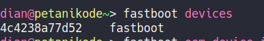
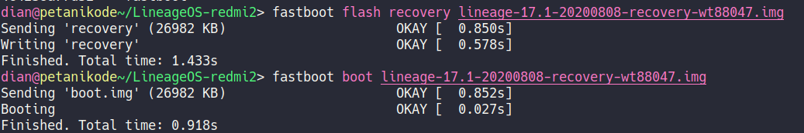
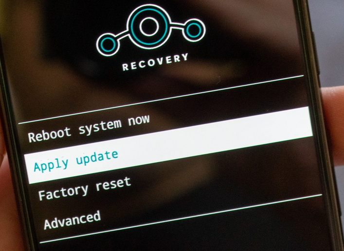
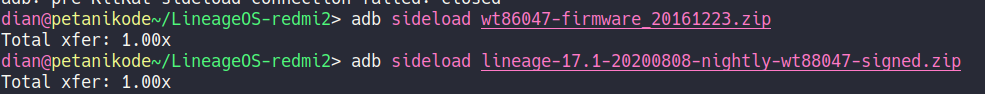

Saya punya HP Xiaomi Redmi 2 (HM2014819) yang sudah lama mati. HP tersebut pernah error, entah karena apa.. ia bootloop.

Salah satu solusi dari permasalah ini adalah flash dengan ROM yang baru.

Saya sempat berpikir, kalau Flashing HP harus pakai Mi Flash. Sedangkan aplikasi Mi Flash belum ada untuk Linux.

Tapi ternyata saya salah.

Flash HP di Linux cukup dilakukan dengan dua tools, yakni `adb` dan `fastboot`. Sebenarnya dua program ini sudah ada di komputer saya, karena sebelumnya saya pernah pakai buat *coding* aplikasi android di android studio.

## Persiapan

1. Sudah menginstal `adb` dan `fastboot`, ini bisa didapatkan dari Android SDK atau juga menginstal dari `apt`
2. Menyiapkan file ROM, saya sendiri pakai [ROM LineageOS](https://wiki.lineageos.org/devices/) 

## Mulai..

Oke, sekarang yang perlu dilakukan adalah booting ke fastboot android. Caranya, tekan tombol volume up + powert. Beda HP beda juga caranya, silahkan cari sendiri di Google.

Setelah itu, hubungkan HP dengan Laptop dengan kabel data.

Ketik `fastboot devices`, jika di sana ada muncul seperti ini:



Maka ini artinya, device kita sudah terdeteksi.

Berikutnya kita harus melakukan flashing dengan recovery image dari ROM yang didapatkan dari LineageOS.

Ketik perintah:

```bash
fastboot flash nama-file-recovery.img
```

Setelah itu, lakukan booting ke image tersebut dengan perintah:

```bash
fastboot boot nama-file-recovery.img
```

Contoh outputnya akan seperti ini:



Pada tahapan ini, kita sudah melakukan flash recovery image ke HP. Nah, dari sini kita bisa melakukan factory reset dan menghapus semua data yang ada di HP.

Setelah itu, kita akan menginstal Firmware dan ROM dari LineageOS dengan `adb`.

Masih dalam mode recovery lineageos, masuk ke menu **Apply Update** > **Apply from ADB**. Sehingga device siap menerima file zip dari `adb sideload` .



Jika device dalam status siap menerima `adb sideload`, maka kita bisa install Firmware dan ROM.



Setelah itu, kita tinggal reboot HP-nya dengan perintah:

```
adb reboot
```

Done.

## Itu saja?

Ya, cuma itu ada sih. Selanjutnya tinggal install aplikasi yang dibutuhkan seperti Playstore, Gmail, dan lain-lain.